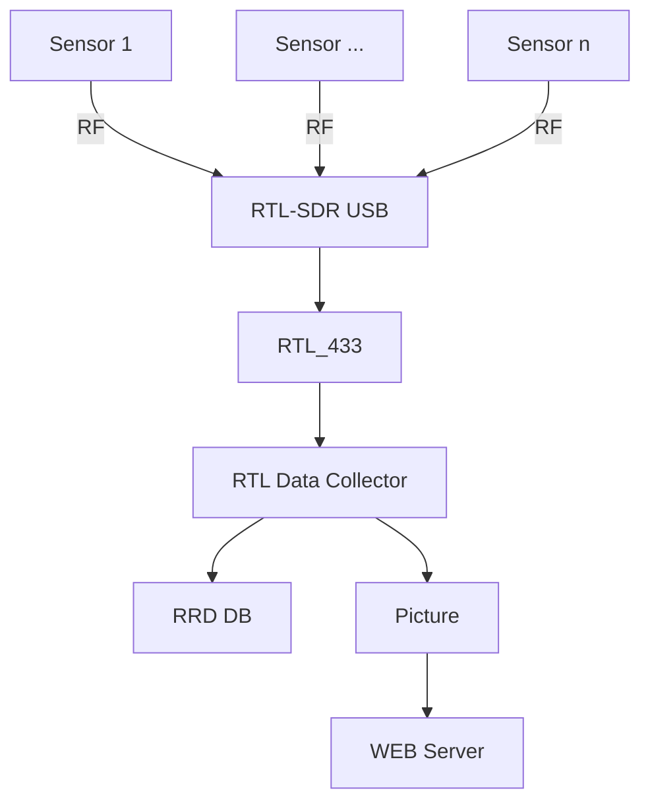

# Modules Diagram

```mermaid
graph TD
        A1[Sensor 1] -- RF --> B[RTL-SDR USB];
        A2[Sensor ...] -- RF --> B;
        A3[Sensor n] -- RF --> B;
        B --> C[RTL_433];
        C --> D[RTL Data Collector];
        D --> E[RRD DB];
        D --> F[Picture];
        F --> G[WEB Server];
```
